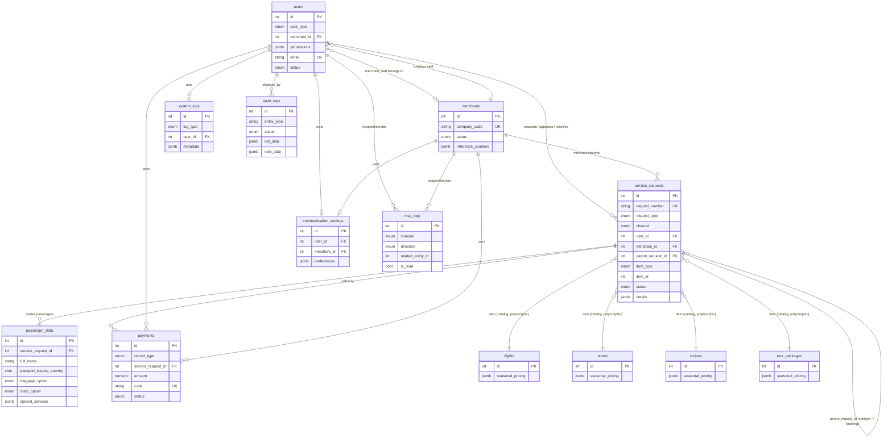

# Database Redesign — 9-Table Operational Schema (2026)

**Status: APPROVED TARGET ARCHITECTURE.** The existing 41-table schema is now
legacy. The previous 70-table domain-separated proposal
([`DATABASE_STRUCTURE.md`](DATABASE_STRUCTURE.md) /
[`FIELD_MAPPING.md`](FIELD_MAPPING.md)) is kept for reference only and is not
the source of truth for this redesign.

This document is the final design. Implementation artifacts (SQLAlchemy
models, DDL, Alembic migration, data-migration strategy, service layer) are
tracked alongside it — see §8. **Nothing has been applied to the live
database.** New schema objects are generated as additive, reversible
artifacts; the cutover itself (running the migration + switching the running
app to the new tables + retiring the old ones) is called out explicitly as
the one step still requiring a final go/no-go, consistent with how this repo
already treats live schema changes (migration `0023` was generated and
verified but deliberately not applied without separate confirmation).

---

## 1. Target Architecture

**9 operational tables:** `users`, `merchants`, `service_requests`,
`payments`, `passenger_data`, `communication_settings`, `msg_logs`,
`system_logs`, `audit_logs`.

**4 catalog tables (unavoidable, kept separate):** `flights`, `hotels`,
`cruises`, `tour_packages`. These are the actual sellable products — real
inventory with admin-entered price/availability/schedule data that customers
and merchants search against. They cannot be embedded as JSON inside an
operational table without breaking search, filtering, and price integrity,
and duplicating that data into every `service_requests` row would violate
"avoid duplicated data." They are the one deliberate exception to "no
additional business tables," because they are not additional — they are the
core product data the other 9 tables reference.

**Total live footprint: 13 tables**, down from 41. Every table that isn't in
this list of 13 has been merged, embedded, or (in two flagged cases) dropped
— see §4 for the full accounting.

### What changed from the previous draft of this document

Three things that were previously kept as small separate reference tables are
now embedded, per the tightened "no additional business tables unless
absolutely unavoidable" instruction:

- **`countries`** → no longer a table. `passenger_data` stores
  `passport_issuing_country` / `nationality_country` as a constrained
  `CHAR(2)` ISO-3166-1 alpha-2 code (`CHECK (col ~ '^[A-Z]{2}$')`) instead of
  an FK to a lookup table. This is standard practice — ISO country codes are
  a fixed external standard, not application-managed reference data.
- **`ancillary_service_catalog`** → no longer a table. Baggage and meal
  options become fixed `ENUM` columns (`baggage_option_enum`,
  `meal_option_enum`) directly on `passenger_data`; "which special services a
  passenger selected" becomes a `TEXT[]`/JSONB array of short codes on the
  same row instead of catalog-ID foreign keys.
- **`seasonal_prices`** → no longer a table. Each catalog table
  (`flights`/`hotels`/`cruises`/`tour_packages`) gains a `seasonal_pricing
  JSONB` column: an array of `{start_date, end_date, override_price, label}`
  objects, scoped to that one item automatically (no more `item_type`/
  `item_id` polymorphism needed for this data).

And one scope call, made explicit rather than silent:

- **`reviews` and `wishlist`** are **dropped**, not migrated. They were never
  in the "Business Functionality Must Remain" list, and the instruction is
  now explicit that the 41-table structure should not be preserved and that
  new tables should be avoided whenever practical. If this turns out to be
  wrong, reintroducing them later is a small, additive change — but keeping
  them "just in case" was in tension with the stated goal, so this document
  resolves the tension by dropping them and recording that decision here.

---

## 2. Architecture Rationale (unchanged from prior draft, restated)

| # | Table | Why it exists |
|---|---|---|
| 1 | `users` | Every human actor — customer, admin, super admin, merchant staff — is "a person who can log in and has a role." One identity table with a `user_type` discriminator replaces `users`, `roles`, `permissions`, `role_permissions`, `partner_users`, and the live-OTP portion of `partner_otp_requests`. |
| 2 | `merchants` | The one non-person account concept — a partner company. Replaces `partners` + its profile fields + `booking_reference_counters`. |
| 3 | `service_requests` | Every "someone asked for something, it has a lifecycle" record — bookings, ticket enquiries, cancellations, refunds, date changes, passenger modifications, support tickets — shares the same shape. One polymorphic table with `request_type` + a self-referential `parent_request_id` replaces 9 tables. |
| 4 | `payments` | Every monetary record — transaction, coupon code, discount campaign — shares amount/validity/status shape. Merged per explicit instruction; biggest denormalization trade-off, flagged in §5. |
| 5 | `system_logs` | Disposable operational history — activity feed, sessions, report runs, status-change events. |
| 6 | `audit_logs` | Compliance-grade before/after row snapshots. Kept separate from `system_logs` because audit trails must outlive pruned operational logs. |
| 7 | `communication_settings` | Per-user/per-merchant opt-in preferences — config-shaped, not message or account data. |
| 8 | `msg_logs` | Every message that left or entered the system — notifications, email, SMS, WhatsApp, live chat, newsletter signups, contact-form submissions, OTP sends. |
| 9 | `passenger_data` | Named passengers tied to a `service_request`. The one clear one-to-many that doesn't collapse into a discriminator. |

---

## 3. ER Diagram

---

## 4. Complete Legacy-Table Mapping

| Legacy table | Destination |
|---|---|
| `users` | → `users` |
| `roles` | → `users` (`user_type` + `permissions` JSONB) |
| `permissions` | → `users.permissions` |
| `role_permissions` | → `users.permissions` |
| `flights` | → `flights` (kept, gains `seasonal_pricing` JSONB) |
| `hotels` | → `hotels` (kept, gains `seasonal_pricing` JSONB) |
| `cruises` | → `cruises` (kept, gains `seasonal_pricing` JSONB) |
| `tour_packages` | → `tour_packages` (kept, gains `seasonal_pricing` JSONB) |
| `seasonal_prices` | → embedded in each catalog table's `seasonal_pricing` JSONB |
| `ancillary_service_catalog` | → embedded as `baggage_option_enum`/`meal_option_enum` on `passenger_data` |
| `countries` | → embedded as `CHAR(2)` ISO code columns on `passenger_data` |
| `reviews` | **dropped** — not in required functionality, conflicts with "avoid new tables" |
| `wishlist` | **dropped** — same reasoning |
| `bookings` | → `service_requests` (`request_type='booking'`, `channel='customer'`) |
| `payments` | → `payments` (`record_type='transaction'`) |
| `discount_campaigns` | → `payments` (`record_type='discount_campaign'`) |
| `coupons` | → `payments` (`record_type='coupon'`) |
| `contact_us` | → `msg_logs` (`channel='contact_form'`) |
| `newsletter` | → `msg_logs` (`channel='newsletter'`) |
| `notifications` | → `msg_logs` (`channel='notification'`) |
| `activity_logs` | → `system_logs` (`log_type='activity'`) |
| `user_sessions` | → `system_logs` (`log_type='session'`) |
| `support_tickets` | → `service_requests` (`request_type='support_ticket'`, `channel='customer'`) |
| `partners` | → `merchants` |
| `partner_users` | → `users` (`user_type='merchant_staff'`) |
| `partner_otp_requests` | → `users` (live OTP state) + `msg_logs` (`channel='otp'`, historical send log) |
| `booking_reference_counters` | → `merchants.reference_counters` |
| `partner_bookings` | → `service_requests` (`request_type='booking'`, `channel='merchant'`) |
| `partner_booking_passengers` | → `passenger_data` |
| `service_requests` (partner, parent) | → `service_requests` (subtype rows, `channel='merchant'`) |
| `cancellation_requests` | → `service_requests` (`request_type='cancellation'`) |
| `cancellation_request_passengers` | → `service_requests.details.passenger_ids` (JSONB array) |
| `date_change_requests` | → `service_requests` (`request_type='date_change'`) |
| `refund_requests` | → `service_requests` (`request_type='refund'`) + `payments` |
| `passenger_modification_requests` | → `service_requests` (`request_type='passenger_modification'`, `details`) |
| `partner_payments` | → `payments` (`record_type='transaction'`, `merchant_id` set) |
| `report_generation_log` | → `system_logs` (`log_type='report_generation'`) |
| `partner_notifications` | → `msg_logs` (`channel='notification'`, `merchant_id` set) |
| `partner_audit_logs` | → `audit_logs` |
| `partner_booking_status_history` *(SQL-only)* | → `system_logs` (`log_type='status_change'`) |
| `service_request_status_history` *(SQL-only)* | → `system_logs` (`log_type='status_change'`) |

All 41 legacy tables accounted for: 25 collapse into the 9 operational
tables, 4 remain as catalog tables, 3 (`seasonal_prices`,
`ancillary_service_catalog`, `countries`) become embedded columns, and 2
(`reviews`, `wishlist`) are dropped by deliberate decision.

---

## 5. Trade-offs and Judgment Calls

1. **Coarse RBAC instead of normalized permissions.** `roles`/`permissions`/`role_permissions` collapse into `users.user_type` + a `permissions` JSONB array. Materially less flexible than granular role→permission grants, but required to hit the table budget.
2. **`payments` mixes transactional and reference data.** Real money-movement rows share a table with promotional code definitions with a different lifecycle. Implemented as explicitly instructed.
3. **The ~33 existing stored procedures are the real cost, not the schema.** Every `sp_*`/`fn_*` function in `backend/db/partner_portal/` is keyed to today's table/column names and must be rewritten against the new schema or reimplemented in the Python service layer. This dominates the total migration effort.
4. **`reviews`/`wishlist` are dropped**, trading "preserve all data" against "minimize tables" — resolved in favor of the tightened table-count instruction, recorded here so it's a deliberate choice.
5. **ISO country codes and enum-based ancillary options** trade a small amount of referential flexibility (no admin UI to add a new baggage option without a code change) for eliminating two tables. Acceptable since both option sets change rarely in practice.
6. **`service_requests.item_id` stays a polymorphic non-FK column**, same as today's `bookings.item_id` — pre-existing pattern, not a regression.
7. **JSONB arrays (`special_services`, `details.passenger_ids`, `seasonal_pricing`)** trade queryability for table-count budget — fine at current data volume, worth revisiting with a join table only if scale ever demands it.

---

## 6. Application Modules Requiring Updates

- **`backend/app/models/`** — full rewrite; see the new `target_schema/` package (§8) staged alongside the live models so the running app is not touched until cutover.
- **`backend/app/services/`** — `admin_service.py`, `admin_merchant_service.py`, all partner services, report builders.
- **`backend/app/auth/`** — `partner_deps.py`, `security.py` (JWT claims), `super_admin_deps.py`.
- **`backend/app/schemas/`** — every Pydantic schema mirroring a legacy table.
- **`backend/db/partner_portal/`, `backend/db/core/`** — all triggers/procedures rewritten against the new schema.
- **Alembic** — new chain / cutover migration (§8).
- **Frontend** (`admin.js`, `partner-portal.html`/JS, `index.html` JS) — API payload shapes change wherever flat columns move into `details`/`metadata` JSONB.

---

## 7. Business Functionality Coverage Check

| Required functionality | Covered by |
|---|---|
| Super Admin | `users.user_type='super_admin'` |
| Admin | `users.user_type='admin'` |
| Merchant Portal | `merchants` + `users.user_type='merchant_staff'` |
| OTP Login | `users.otp_hash`/`otp_purpose`/`otp_expires_at` + `msg_logs` (`channel='otp'`) |
| Ticket Enquiry | `service_requests` (`request_type='ticket_enquiry'`) |
| Ticket Booking | `service_requests` (`request_type='booking'`) |
| Booking History | `service_requests` filtered by `user_id`/`merchant_id` |
| Cancellation | `service_requests` (`request_type='cancellation'`) |
| Refund | `service_requests` (`request_type='refund'`) + `payments` |
| Date Change | `service_requests` (`request_type='date_change'`) |
| Passenger Modification | `service_requests` (`request_type='passenger_modification'`) |
| Payment Management | `payments` |
| Reports | `system_logs` (`log_type='report_generation'`) + queries over `service_requests`/`payments` |
| Live Chat | `msg_logs` (`channel='live_chat'`) |
| Notifications | `msg_logs` (`channel='notification'`) |
| Audit Logs | `audit_logs` |
| Activity Logs | `system_logs` (`log_type='activity'`) |

Every required item maps to a concrete table/column. Nothing on the required
list is unsupported by this design.

---

## 8. Implementation Artifacts

| Artifact | Location | Status |
|---|---|---|
| SQLAlchemy models | `backend/app/models/target_schema/` | Done — not yet imported by the live app |
| DDL scripts | `backend/db/target_schema/` | Done — not yet run against any database |
| Alembic migration (additive) | `backend/alembic/versions/0025_target_schema_9table.py` | Done — not yet applied |
| Data migration strategy + backfill | `docs/DATA_MIGRATION_STRATEGY_9TABLE.md` + `backend/db/target_schema/05_backfill.sql` | Done as a first draft — has open `-- VERIFY:` items, must be rehearsed against a DB copy first |
| Service layer (CRUD) | `backend/app/services/target_schema/` | Core CRUD done for all 9 tables — not a 1:1 replacement of the ~33 legacy stored procedures' business logic yet |
| Router/schema cutover checklist | `docs/ROUTER_CUTOVER_CHECKLIST.md` | Done — routers themselves not yet rewired |

**None of these are wired into the running application yet.** The new
models/services live in a parallel `target_schema` location specifically so
the current, working, live-verified app (see
[`MIGRATION_VERIFICATION_2026.md`](MIGRATION_VERIFICATION_2026.md)) keeps
running unmodified until an explicit cutover decision is made. Cutover means:
run the additive migration → run the data backfill → verify → swap
`backend/app/models/__init__.py` and routers to the new services → retire
the legacy tables in a follow-up migration. Each of those steps is
independently reversible except the final legacy-table drop, which is why
it's kept as its own last, explicitly-confirmed step.
