# Database Structure — v2: Fully Domain-Separated Design

This is a revision of the earlier four-domain proposal in [`database/`](../database/README.md),
built to one hard rule: **no authentication, profile, session, or activity-log
table is shared across Admin, Merchant, and User.** Each portal now owns its
identity end to end. Nothing here has been applied to the live
`jackpotsworldtours` database — this remains a documented proposal only.

---

## 1. What changed from v1, and why

v1 already split Admin out of the shared `users` table. This revision goes
further: it eliminates every remaining place where two domains leaned on the
same table.

| Problem in v1 (or in the live DB) | v2 fix |
|---|---|
| `partner_users` had a `role_id` FK into the shared `roles` table | `partner_staff` (renamed) uses only its own `role_type`/`member_role` enums — already the real mechanism the UI uses (`ROLE_TYPE_MEMBER_ROLES` in `admin_merchant.py`). Shared `roles` FK dropped. |
| `users.role_id` FK into the shared `roles` table | Dropped. Once Admin is fully split out, every `users` row is implicitly a customer — there is no other role a customer account can have. |
| Shared `roles` / `permissions` / `role_permissions` served both `users` and `partner_users` | **Retired.** Each domain now owns its own equivalent: `admin_roles`/`admin_permissions` (Admin), `role_type`/`member_role` enums (Merchant, unchanged), nothing (User — customers have no sub-roles). |
| Admin Portal's live notification bell (`notifBellBtn`) reads the **same** `/api/notifications` table the customer portal uses, keyed off the admin's row in the shared `users` table | New `admin_notifications` table gives the admin bell its own domain-scoped home. This is a real bug fix, not just a naming exercise — see §4. |
| `partner_audit_logs` vs. the customer-domain `activity_logs` had inconsistent naming | Renamed for consistency: `partner_audit_logs` → `partner_activity_logs`, `activity_logs` → `user_activity_logs`, alongside the already-domain-scoped `admin_activity_logs`. |
| No dedicated session table for Merchant or User activity tracking beyond login-event rows | Merchant gets `partner_sessions` (new); User already had `user_sessions`; Admin already had `admin_sessions`. All three now symmetric. |

**70 tables total** (up from 46 in v1): 22 Shared, 8 Admin, 28 Merchant, 12 User.

---

## 2. The one rule, verified

> No authentication, profile, session, or activity-log table is shared
> across Admin, Merchant, or User.

This is mechanically true in the schema, not just asserted:

- **Authentication**: `admins` (Admin), `partner_staff` (Merchant), `users`
  (User) — three separate tables, three separate password hashes, three
  separate login flows. None references another domain's auth table.
- **Profile**: `admin_profiles` / `partner_profiles` / `user_profiles` —
  each keyed to its own domain's PK, never cross-referenced.
- **Session**: `admin_sessions` / `partner_sessions` / `user_sessions` —
  same pattern.
- **Activity log**: `admin_activity_logs` / `partner_activity_logs` /
  `user_activity_logs` — same pattern. (`audit_logs` in Shared is
  narrower and different in kind — see §5.)

The **only** FKs that cross a domain boundary are business attributions —
an admin approving a merchant's booking, not an admin *authenticating as* a
merchant:

`admins.id` ← `partner_bookings.approved_by` / `.rejected_by`,
`service_requests.resolved_by`, `partner_booking_status_history
.changed_by_admin_id`, `service_request_status_history
.changed_by_admin_id`, `audit_logs.changed_by_admin_id`.

That's it — no other table in Merchant or User references anything in
another domain's identity tables, and Merchant and User never reference
each other at all.

---

## 3. Domain summary

| Domain | Tables | Auth | Profile | Session | Activity Log | Notifications |
|---|---|---|---|---|---|---|
| **Shared** | 22 | — | — | — | — (see §5) | — |
| **Admin** | 8 | `admins` | `admin_profiles` | `admin_sessions` | `admin_activity_logs` | `admin_notifications` |
| **Merchant** | 28 | `partner_staff` | `partner_profiles` | `partner_sessions` | `partner_activity_logs` | `partner_notifications` |
| **User** | 12 | `users` | `user_profiles` | `user_sessions` | `user_activity_logs` | `user_notifications` |

---

## 4. Entity-Relationship Diagram

```mermaid
erDiagram
    %% ---- SHARED DOMAIN ----
    countries {
        INTEGER country_id PK
        VARCHAR(100) name UK
        CHAR(2) iso2 UK
        CHAR(3) iso3 UK
    }
    states {
        SERIAL id PK
        INTEGER country_id FK
    }
    cities {
        SERIAL id PK
        INTEGER state_id FK
    }
    currencies {
        SERIAL id PK
        CHAR(3) code UK
    }
    languages {
        SERIAL id PK
        VARCHAR(10) code UK
    }
    airports {
        SERIAL id PK
        CHAR(3) iata_code UK
        INTEGER city_id FK
        INTEGER country_id FK
    }
    airlines {
        SERIAL id PK
        VARCHAR(3) iata_code UK
    }
    flights {
        SERIAL id PK
    }
    hotel_chains {
        SERIAL id PK
        VARCHAR(150) name UK
    }
    hotels {
        SERIAL id PK
    }
    cruise_lines {
        SERIAL id PK
        VARCHAR(150) name UK
    }
    cruises {
        SERIAL id PK
    }
    tour_packages {
        SERIAL id PK
    }
    package_images {
        SERIAL id PK
        INTEGER package_id FK
    }
    seasonal_prices {
        SERIAL id PK
    }
    coupons {
        SERIAL id PK
        VARCHAR(40) code UK
    }
    discount_campaigns {
        SERIAL id PK
    }
    payment_methods {
        SERIAL id PK
        VARCHAR(30) code UK
    }
    system_settings {
        SERIAL id PK
        VARCHAR(100) setting_key UK
    }
    audit_logs {
        SERIAL id PK
        INTEGER changed_by_admin_id FK
    }
    contact_us {
        SERIAL id PK
    }
    newsletter {
        SERIAL id PK
        VARCHAR(255) email UK
    }
    %% ---- ADMIN DOMAIN ----
    admin_roles {
        SERIAL id PK
        VARCHAR(50) name UK
    }
    admin_permissions {
        SERIAL id PK
        VARCHAR(80) permission_key UK
    }
    admin_role_permissions {
        INTEGER admin_role_id PK,FK
        INTEGER admin_permission_id PK,FK
    }
    admins {
        SERIAL id PK
        VARCHAR(255) email UK
        INTEGER role_id FK
    }
    admin_profiles {
        INTEGER admin_id PK,FK
    }
    admin_sessions {
        SERIAL id PK
        INTEGER admin_id FK
    }
    admin_activity_logs {
        SERIAL id PK
        INTEGER admin_id FK
    }
    admin_notifications {
        SERIAL id PK
        INTEGER admin_id FK
    }
    %% ---- MERCHANT DOMAIN ----
    partners {
        INTEGER partner_id PK
        VARCHAR(30) company_code UK
        VARCHAR(6) reference_prefix UK
        VARCHAR(255) email UK
    }
    partner_profiles {
        INTEGER partner_id PK,FK
    }
    partner_staff {
        INTEGER staff_id PK
        INTEGER partner_id FK
        VARCHAR(255) email UK
        VARCHAR(20) phone_number UK
        VARCHAR(50) username UK
    }
    partner_sessions {
        SERIAL id PK
        INTEGER staff_id FK
    }
    partner_otp_requests {
        INTEGER otp_id PK
        INTEGER staff_id FK
    }
    booking_reference_counters {
        INTEGER partner_id PK,FK
        SMALLINT year PK
    }
    partner_bookings {
        INTEGER booking_id PK
        VARCHAR(20) reference_number UK
        INTEGER partner_id FK
        INTEGER staff_id FK
        INTEGER flight_id FK
        INTEGER hotel_id FK
        INTEGER cruise_id FK
        INTEGER approved_by FK
        INTEGER rejected_by FK
    }
    partner_booking_passengers {
        INTEGER passenger_id PK
        INTEGER booking_id FK
        INTEGER passport_issuing_country_id FK
        INTEGER nationality_country_id FK
        INTEGER baggage_catalog_id FK
        INTEGER meal_catalog_id FK
    }
    ancillary_service_catalog {
        SERIAL catalog_id PK
    }
    passenger_special_services {
        SERIAL id PK
        INTEGER passenger_id FK
        INTEGER catalog_id FK
    }
    service_requests {
        INTEGER service_request_id PK
        VARCHAR(20) service_request_number UK
        INTEGER booking_id FK
        INTEGER staff_id FK
        INTEGER resolved_by FK
    }
    cancellation_requests {
        INTEGER service_request_id PK,FK
    }
    cancellation_request_passengers {
        INTEGER service_request_id PK,FK
        INTEGER passenger_id PK,FK
    }
    date_change_requests {
        INTEGER service_request_id PK,FK
        INTEGER passenger_id FK
    }
    refund_requests {
        INTEGER service_request_id PK,FK
        INTEGER payment_id FK
    }
    passenger_modification_requests {
        INTEGER service_request_id PK,FK
        INTEGER passenger_id FK
    }
    partner_payments {
        INTEGER payment_id PK
        INTEGER booking_id FK
        VARCHAR(100) transaction_ref UK
    }
    report_generation_log {
        INTEGER report_id PK
        INTEGER partner_id FK
        INTEGER staff_id FK
    }
    partner_notifications {
        INTEGER notification_id PK
        INTEGER staff_id FK
    }
    partner_activity_logs {
        INTEGER activity_id PK
        INTEGER partner_id FK
        INTEGER staff_id FK
    }
    partner_booking_status_history {
        INTEGER history_id PK
        INTEGER booking_id FK
        INTEGER changed_by_admin_id FK
        INTEGER changed_by_staff_id FK
    }
    service_request_status_history {
        INTEGER history_id PK
        INTEGER service_request_id FK
        INTEGER changed_by_admin_id FK
        INTEGER changed_by_staff_id FK
    }
    partner_bank_accounts {
        SERIAL id PK
        INTEGER partner_id FK
    }
    partner_documents {
        SERIAL id PK
        INTEGER partner_id FK
    }
    partner_wallet {
        INTEGER partner_id PK,FK
    }
    partner_wallet_transactions {
        SERIAL id PK
        INTEGER partner_id FK
    }
    partner_commissions {
        SERIAL id PK
        INTEGER partner_id FK
        INTEGER booking_id FK
    }
    partner_invoices {
        SERIAL id PK
        INTEGER partner_id FK
        INTEGER booking_id FK
        VARCHAR(30) invoice_number UK
    }
    %% ---- USER DOMAIN ----
    users {
        SERIAL id PK
        VARCHAR(255) email UK
    }
    user_profiles {
        INTEGER user_id PK,FK
    }
    user_addresses {
        SERIAL id PK
        INTEGER user_id FK
    }
    user_sessions {
        SERIAL id PK
        INTEGER user_id FK
    }
    user_activity_logs {
        SERIAL id PK
        INTEGER user_id FK
    }
    user_bookings {
        SERIAL id PK
        INTEGER user_id FK
    }
    booking_passengers {
        SERIAL id PK
        INTEGER booking_id FK
    }
    user_payments {
        SERIAL id PK
        INTEGER booking_id FK
        INTEGER user_id FK
    }
    user_reviews {
        SERIAL id PK
        INTEGER user_id FK
    }
    user_wishlist {
        SERIAL id PK
        INTEGER user_id FK
    }
    user_support_tickets {
        SERIAL id PK
        INTEGER user_id FK
    }
    user_notifications {
        SERIAL id PK
        INTEGER user_id FK
    }
    %% ---- RELATIONSHIPS ----
    countries ||--o{ states : "country_id"
    states ||--o{ cities : "state_id"
    cities ||--o{ airports : "city_id"
    countries ||--o{ airports : "country_id"
    tour_packages ||--o{ package_images : "package_id"
    admins ||--o{ audit_logs : "changed_by_admin_id"
    admin_roles ||--o{ admin_role_permissions : "admin_role_id"
    admin_permissions ||--o{ admin_role_permissions : "admin_permission_id"
    admin_roles ||--o{ admins : "role_id"
    admins ||--o{ admin_profiles : "admin_id"
    admins ||--o{ admin_sessions : "admin_id"
    admins ||--o{ admin_activity_logs : "admin_id"
    admins ||--o{ admin_notifications : "admin_id"
    partners ||--o{ partner_profiles : "partner_id"
    partners ||--o{ partner_staff : "partner_id"
    partner_staff ||--o{ partner_sessions : "staff_id"
    partner_staff ||--o{ partner_otp_requests : "staff_id"
    partners ||--o{ booking_reference_counters : "partner_id"
    admins ||--o{ partner_bookings : "approved_by"
    admins ||--o{ partner_bookings : "rejected_by"
    cruises ||--o{ partner_bookings : "cruise_id"
    flights ||--o{ partner_bookings : "flight_id"
    hotels ||--o{ partner_bookings : "hotel_id"
    partners ||--o{ partner_bookings : "partner_id"
    partner_staff ||--o{ partner_bookings : "staff_id"
    ancillary_service_catalog ||--o{ partner_booking_passengers : "baggage_catalog_id"
    partner_bookings ||--o{ partner_booking_passengers : "booking_id"
    ancillary_service_catalog ||--o{ partner_booking_passengers : "meal_catalog_id"
    countries ||--o{ partner_booking_passengers : "nationality_country_id"
    countries ||--o{ partner_booking_passengers : "passport_issuing_country_id"
    ancillary_service_catalog ||--o{ passenger_special_services : "catalog_id"
    partner_booking_passengers ||--o{ passenger_special_services : "passenger_id"
    partner_bookings ||--o{ service_requests : "booking_id"
    partner_staff ||--o{ service_requests : "staff_id"
    admins ||--o{ service_requests : "resolved_by"
    service_requests ||--o{ cancellation_requests : "service_request_id"
    partner_booking_passengers ||--o{ cancellation_request_passengers : "passenger_id"
    cancellation_requests ||--o{ cancellation_request_passengers : "service_request_id"
    partner_booking_passengers ||--o{ date_change_requests : "passenger_id"
    service_requests ||--o{ date_change_requests : "service_request_id"
    partner_payments ||--o{ refund_requests : "payment_id"
    service_requests ||--o{ refund_requests : "service_request_id"
    partner_booking_passengers ||--o{ passenger_modification_requests : "passenger_id"
    service_requests ||--o{ passenger_modification_requests : "service_request_id"
    partner_bookings ||--o{ partner_payments : "booking_id"
    partners ||--o{ report_generation_log : "partner_id"
    partner_staff ||--o{ report_generation_log : "staff_id"
    partner_staff ||--o{ partner_notifications : "staff_id"
    partners ||--o{ partner_activity_logs : "partner_id"
    partner_staff ||--o{ partner_activity_logs : "staff_id"
    partner_bookings ||--o{ partner_booking_status_history : "booking_id"
    admins ||--o{ partner_booking_status_history : "changed_by_admin_id"
    partner_staff ||--o{ partner_booking_status_history : "changed_by_staff_id"
    admins ||--o{ service_request_status_history : "changed_by_admin_id"
    partner_staff ||--o{ service_request_status_history : "changed_by_staff_id"
    service_requests ||--o{ service_request_status_history : "service_request_id"
    partners ||--o{ partner_bank_accounts : "partner_id"
    partners ||--o{ partner_documents : "partner_id"
    partners ||--o{ partner_wallet : "partner_id"
    partner_wallet ||--o{ partner_wallet_transactions : "partner_id"
    partners ||--o{ partner_commissions : "partner_id"
    partner_bookings ||--o{ partner_commissions : "booking_id"
    partners ||--o{ partner_invoices : "partner_id"
    partner_bookings ||--o{ partner_invoices : "booking_id"
    users ||--o{ user_profiles : "user_id"
    users ||--o{ user_addresses : "user_id"
    users ||--o{ user_sessions : "user_id"
    users ||--o{ user_activity_logs : "user_id"
    users ||--o{ user_bookings : "user_id"
    user_bookings ||--o{ booking_passengers : "booking_id"
    user_bookings ||--o{ user_payments : "booking_id"
    users ||--o{ user_payments : "user_id"
    users ||--o{ user_reviews : "user_id"
    users ||--o{ user_wishlist : "user_id"
    users ||--o{ user_support_tickets : "user_id"
    users ||--o{ user_notifications : "user_id"
```



*(This diagram is generated directly from the actual SQL files, not
hand-transcribed, so it cannot drift from `02_shared_tables.sql` through
`07_constraints.sql`. Entities show PK/FK/UK columns for readability — see
the numbered `.sql` files for every column.)*

---

## 5. Table renames and retirements (full list)

| v1 / live name | v2 name | Why |
|---|---|---|
| `partner_users` | `partner_staff` | Matches your target list; this is Merchant's own auth table |
| `partner_users.partner_user_id` | `partner_staff.staff_id` | Naming consistency |
| `partner_audit_logs` | `partner_activity_logs` | Naming consistency with `admin_activity_logs`/`user_activity_logs` |
| `activity_logs` | `user_activity_logs` | Naming consistency |
| `bookings` | `user_bookings` | Naming consistency |
| `payments` | `user_payments` | Naming consistency |
| `reviews` | `user_reviews` | Naming consistency |
| `wishlist` | `user_wishlist` | Naming consistency |
| `support_tickets` | `user_support_tickets` | Naming consistency |
| `notifications` | `user_notifications` | Naming consistency |
| `roles`, `permissions`, `role_permissions` | *(retired)* | Existed only to let `users` and `partner_users` share one RBAC mechanism — replaced by `admin_roles`/`admin_permissions` (Admin) and enum columns already on `partner_staff` (Merchant) |
| `partner_user_status_enum` | `partner_staff_status_enum` | Follows the table rename |
| every `*.partner_user_id` FK column | `*.staff_id` | Follows the table rename — affects `partner_bookings`, `partner_otp_requests`, `service_requests`, `report_generation_log`, `partner_notifications`, `partner_activity_logs` |
| `*_status_history.changed_by_partner_user_id` | `*_status_history.changed_by_staff_id` | Same |

**`audit_logs`** (Shared) deserves a specific note: it is *not* a violation
of "no shared activity log." It's narrowly scoped to changes made to
Shared-domain data itself (an admin editing a flight price, a hotel, a
`system_settings` value) — a changelog for the catalog, not a cross-domain
user/merchant/admin activity feed. Each domain still keeps its own activity
log for its own actors' actions.

---

## 6. What's real vs. provisioned

Per requirement 14, every table below was checked against the live frontend
before being included. Columns/tables marked **real** back an existing
form or screen today; **provisioned** tables are part of the target
architecture with no current frontend — see [FIELD_MAPPING.md](FIELD_MAPPING.md)
for the exhaustive field-by-field breakdown.

**Real, unchanged (functionality would break without them):** `flights`
(not in your literal list, but `partner_bookings.flight_id` and
`vw_ticket_enquiry` depend on it), `hotels`, `cruises`, `tour_packages`,
`seasonal_prices`, `coupons`, `discount_campaigns`, `contact_us`,
`newsletter`, `countries`, `partners`, `partner_bookings`,
`partner_booking_passengers`, `ancillary_service_catalog`,
`passenger_special_services`, `service_requests` + its 4 subtype tables,
`partner_payments`, `report_generation_log`, `partner_booking_status_history`,
`service_request_status_history`, `partner_otp_requests`,
`booking_reference_counters`, `users`, `user_profiles`, `user_sessions`.

**Real, newly split out (existing live columns, moved for 3NF):**
`partner_profiles` (from `partners`), `admin_profiles` (minimal — see
below).

**Real, fixing an actual bug:** `admin_notifications` — the Admin Portal's
live notification bell currently reads the same table the customer portal
uses; this gives it a proper domain-scoped home.

**Provisioned (new table/columns, no current frontend — production-ready
scaffolding per your request, not wired to any form yet):** `states`,
`cities`, `currencies`, `languages`, `airports`, `airlines`, `hotel_chains`,
`cruise_lines`, `package_images`, `payment_methods`, `system_settings`,
`audit_logs`, `admin_roles`, `admin_permissions`, `admin_role_permissions`
(bootstrap-seeded, not sample data — see `12_seed.sql`), most of
`admin_profiles` (phone/designation/photo), `partner_sessions`,
`partner_bank_accounts`, `partner_documents`, `partner_wallet`(+`_transactions`),
`partner_commissions`, `partner_invoices`, `user_addresses`,
`booking_passengers`.

---

## 7. Index strategy

Every PK gets its implicit index. Every business unique key has an
explicit unique index (`partners.company_code`/`email`/`reference_prefix`,
`partner_staff.email`/`phone_number`/`username`, `admins.email`,
`users.email`, `partner_bookings.reference_number`,
`service_requests.service_request_number`, `partner_invoices.invoice_number`,
etc.). Every FK used in a JOIN-heavy lookup path has a supporting index —
see `06_indexes.sql` for the complete list, grouped by domain, including 6
new indexes added for the new Merchant-domain financial tables
(`partner_bank_accounts`, `partner_documents`, `partner_wallet_transactions`,
`partner_commissions`, `partner_invoices` ×2).

---

## 8. Folder structure

```
database/
├── README.md
├── 01_types.sql            -- 20 enum types (17 kept, 1 renamed, 3 new)
├── 02_shared_tables.sql    -- 22 tables
├── 03_admin_tables.sql     -- 8 tables (all new domain)
├── 04_partner_tables.sql   -- 28 tables
├── 05_user_tables.sql      -- 12 tables
├── 06_indexes.sql
├── 07_constraints.sql
├── 08_views.sql             -- 5 views (1 updated for the rename)
├── 09_functions.sql         -- 10 trigger functions (7 updated, 1 renamed)
├── 10_procedures.sql        -- 26 procedures (14 updated, including a
│                                substantive rewrite of sp_register_partner
│                                and sp_partner_login_lookup)
├── 11_triggers.sql          -- 14 triggers (2 renamed)
├── 12_seed.sql               -- empty except a one-time admin_roles bootstrap note
└── migrate.sql                -- master script, same 12-file order
```

---

## 9. Migration considerations (if this is ever cut over)

Still not something that has been done — for when/if you decide to apply it:

1. **`partner_users` → `partner_staff`**: straightforward rename +
   column rename (`partner_user_id` → `staff_id`), plus dropping
   `role_id` (its data is redundant with `role_type`/`member_role`,
   already populated by migration 0021).
2. **`admins` split from `users`**: same as v1 — copy admin rows out,
   remap the FK columns that used to point at `users(id)` for admin
   actors, this time also bootstrapping `admin_roles` with a single
   `'admin'` row first (since `admins.role_id` is `NOT NULL`).
3. **`admin_notifications` cutover**: requires a small backend change —
   a new `/api/admin/notifications` endpoint backed by `admin_notifications`,
   replacing admin.html's current call to the shared `/api/notifications`.
4. **Backend changes required**: every service/router file touching
   `partner_users`, `partner_audit_logs`, `roles`/`permissions`, or the
   shared `notifications` table for admin use needs updating. This is a
   real, non-trivial application-layer change — the database redesign
   alone doesn't move data or rewrite Python.
5. Until cutover, the live database and this folder describe two
   different (but architecturally compatible) states.
